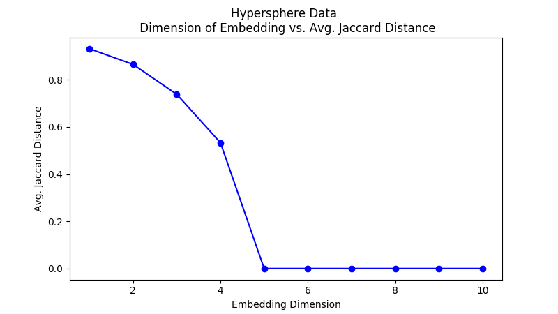

## Average Jaccard Distance:  
### A Method for Evaluating Distortion in Dimensionality Reduction

This code calculates the Average Jaccard Distance between representations of data.  This is a method our labs developed for evaluating the distortion introduced by dimensionality reduction. This code also contains tools for calcualting Graph Edit Distance between trees and Adjusted Rand Index between clustering results.  For a complete description of how we use these tools in our labs check out our pre-print:
https://www.biorxiv.org/content/10.1101/689851v1

This software is written in Python3 and has only been tested on MacOS Mojave 10.14.6 and Ubuntu
18.04.3 LTS, but we have no reason to believe that it won't work on other operating systems.

In order to run the software, you'll need a working version of Python 3 with the following packages installed:

- scipy
- pandas
- numpy
- sklearn
- umap-learn
- random
- os
- sys
- csv
- matplotlib

#### Generating Hyperspheres:

The hypersphere tool generates an n-dimensional hypersphere in a k-dimensional space.  Our labs use objects of this type as one way to test various dimensionality reduction algorithms.

```python
# First, import the hypersphere function:
from calc_ajd import hypersphere

# When you call the function, specify
  # the dimensionality of the hypersphere,
  # the number of samples,
  # and the ambient dimensionality

data = hypersphere(n_dimensions=5,
                  n_samples=1000,
                  k_space=20)

```

#### Average Jaccard Distance:

Now that we have a test data set, here's a quick example of how you might use our code to evaluate the Average Jaccard Distance of dimensionality-reduced representation of your hypersphere data:

```python
# For this, we'll need the functions ndr and ajd:
from calc_ajd import ndr, ajd
# First, we perform dimensionality reduction:
embedding = ndr(data,method='PCA',dim=2)
# Next, we calculate the Average Jaccard Distance:
distortion = ajd(data, embedding)
# Finally, we print our result
print("AJD of embedding:  ", distortion)
```

If you would like to compare the level of distortion introduced in varying embedding dimensions, you can do that like so:

```python
# Declare some lists to store results:
dims = []
results = []
# For each dimension from 1 to 10:
i = 1
while i < 11:
  # Perform dimensionality reduction:
  embedding = ndr(data,method='PCA',dim=i)
  # Calculate GED:
  avg_jaccard_distance = ajd(data,embedding)
  # Add embedding dimensions and AJD result to lists:
  dims.append(i)
  results.append(avg_jaccard_distance)
  i += 1
# Print results:
print(dims)
print(results)
```


If you'd like a plot of the results, you can use matplotlib:

```python
# Remember to import the package!
import matplotlib.pyplot as plt

plt.figure(figsize=(16, 9))
plt.plot(dims,results)
plt.title('Practice Data \n Dimension of Embedding vs. Avg. Jaccard Distance')
plt.xlabel('Embedding Dimension')
plt.ylabel('Avg. Jaccard Distance')
plt.show()
```
Your result should look something like this:




Note: To run this software on real data, you'll first need to get your data into a pandas DataFrame with cells as rows and genes as columns.  How to do this varies depending on where you're getting your data from, so we can't include comprehensive instructions here, but if you have a .csv file, you do something like this:

```python
data = read_csv('myData.csv')
```
#### Graph Edit Distance:

Graph Edit Distance measures the difference between  trees.  For a more comprehensive description, here's the wikipedia page: https://en.wikipedia.org/wiki/Graph_edit_distance  

In order to use this tool, we'll proceed in a way similar to what we did above:

```python
from calc_ajd import ged, mst
# Declare some lists to store results:
dims = []
results = []
# We only need to find the minimum spanning tree in the original data once:
highD_tree = mst(data)  
# For each dimension from 1 to 10:
i = 1
while i < 11:
  # Perform dimesnionality reduction:
  embedding = ndr(data,method='PCA',dim=i)
  # Now we find the minimum spanning tree in the new representation of the data:
  lowD_tree = mst(embedding)
  # We calculate the Graph Edit Distance between the trees:
  graph_edit_distance = ged(highD_tree,lowD_tree)
  # And add our data to the relevant lists:
  dims.append(i)
  results.append(graph_edit_distance)
```

To plot these results, we'll use matplotlib again:

```python
plt.figure(figsize=(8, 4.5))
plt.plot(dims,results)
plt.title('Practice Data \n Dimension of Embedding vs. Graph Edit Distance btwn. Minimum Spanning Trees')
plt.xlabel('Embedding Dimension')
plt.ylabel('Graph Edit Distance')
plt.show()
```

If you used the same hypersphere data, your GED result should look just like your AJD result:


This is because PCA doesn't distort local relationships in the data as long as the dimension of the manifold is equal or less than that of the embedding!  Food for thought!
